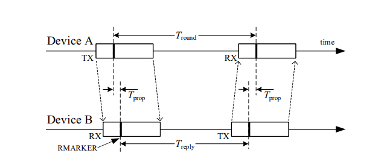
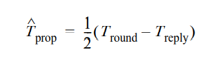
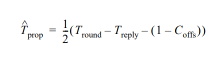
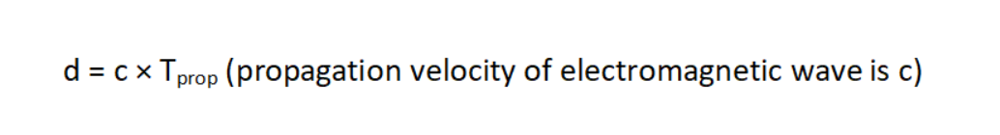
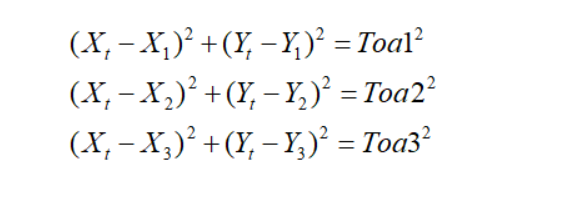
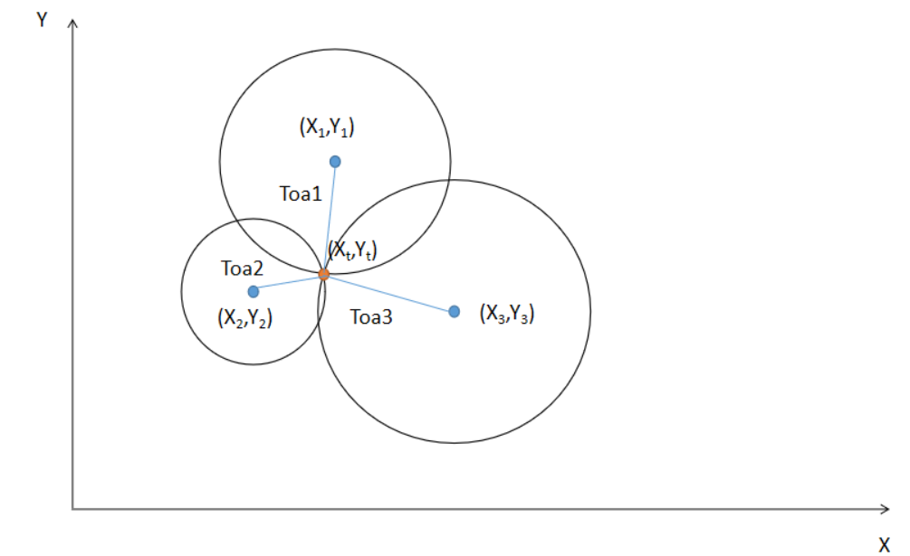

| 

  |  |  |
| -- | -- | -- |

# RAKwireless UWB library

Rakwireless UWB library is modified from arduino-dw1000-ng for the Arduino platform, which is based on MIT LICENSE. Because this library is very comprehensive and has abundant examples. However we just modify the SPI part to suit for RAK Core. So this library completely inherits the functions of arduino-dw1000-ng. 

[*RAKWireless RAK13801 UWB*](https://store.RAKWireless.com/products/RAK13801-UWB)

# UWB introduction

Ultra-wideband (UWB) is a radio technology based on the IEEE 802.15.4a and 802.15.4z standards that can enable the very accurate measure of the Time of Flight of the radio signal, leading to centimeter accuracy distance/location measurement.

In addition to this unique capability, UWB offers data communication capability while using extremely little energy – enabling coin cell operation for years without needing to be recharged or replaced. By combining accurate location and communication, UWB also offers a new way of securely communicating over wireless, opening the door to new forms of secure transactions. Below is the comparison of several wireless technology.

# Data Transmission

UWB is a data transmission solution of close range, which has below feature:

- Distance : within 10 m
- Bandwidth: 3.1 GHz～10.6 GHz
- Channel: 1 ~ 7, use different from region
- Speed: Tens of Mbit/s to hundreds of Mbit/s
- Low power
- Small size
- Low transmitting power
- As a replacement of BLE or WIFI

About the protocol of data in air, user can find details. Please refer the document in ../doc/802154z-2020.pdf, which is based on **IEEE Std 802.15.4z™-2020**.

This library provides two basic data transmission, which contains the protocol API and user just need to make some configuration about the parameters. Please be sure they are same between **Sender** and **Receiver**.

-   SFDMode: Start Frame separator field, here user can choose STANDARD_SFD or DECAWAVE_SFD
-   Channel: 1 to 7
-   DataRate: Data Transfer Rate. RATE_110KBPS, RATE_850KBPS, RATE_6800KBPS
-   PulseFrequency:  There are two choices. FREQ_16MHZ or FREQ_64MHZ
-   PreambleLength:  The length of preamble code
  - LEN_64 
  - LEN_128 
  - LEN_256 
  - LEN_512  
  - LEN_1024
  - LEN_1536 
  - LEN_2048 
  - LEN_4096 
-   PreambleCode: The type of preamble code. CODE_1 to CODE_20.

# Indoor Location

UWB indoor positioning technology is a kind of wireless technology based on very narrow pulse. The inherent physical characteristics of UWB RF signal make UWB technology clearly defined from the beginning: it can achieve real-time, ultra accurate, ultra reliable positioning and communication. It can measure the flight time of radio signal very accurately, so as to realize the centimeter precision distance / position measurement.

Time of flight ranging (TOF) and time difference of arrival (TDOA) are widely used in UWB technology. From the point of view of positioning methods, they all belong to multi-point positioning, that is, to determine the relative position relationship between the label and several known coordinate points for positioning.

No matter the TOF or TDOA, UWB indoor positioning technology always contains two basic elements:

- **Anchor**: a fixed uwb node in a known place. There needs at least two in a X-Y plane-coordinate system
- **Tag**: node which needs positioning

### 1. TOF

Time of flight (TOF) is a two-way ranging technology, which calculates the distance by measuring the flying time of UWB signal between the base station and the tag.

SS-TWR, described in 6.9.1.2.2 of protocol document, which involves a measurement of the round-trip delay of a single message from one device(anchor) to another(tag) and a response sent back to the original device. The operation of SS-TWR is as shown below, where device A initiates the exchange and device B responds to complete the exchange and *T*prop is the propagation time of the RMARKER between the devices.

Each device precisely measures the transmission and reception times of the message frames, and so can calculate times Tround and Treply by simple subtraction. Hence, the resultant TOF may be estimated as  by the equation:

The times Tround and Treply are measured independently by device A and B using their local clocks, which both have some clock frequency offset error eA and eB, respectively, from their nominal frequency. Therefore, the resulting TOF estimate has a considerable error that increases as the reply times get larger, as explained in “Applications of IEEE Std 802.15.4” [B3]. However if the receiver of device A has the capability to measure the relative clock offset between itself and the remote device B transmitter, Coffs, then this may be used to adjust the reported Treply value to improve the accuracy of the TOF estimate using the equation:

When the receiver has the capability to measure the relative clock frequency offset this is reported via the RangingTrackingInterval and RangingOffset parameters of the MCPS-DATA.confirm or MCPS-DATA.indication primitives.

When employing SS-TWR, for the TOF to be calculated at device A, device A needs the reply time Treply employed by device B. When Treply is determined by device B after its transmission, an additional message is necessary to bring this value to device A, as shown in Figure 6-48a and described in 6.9.6.3. When Treply can be accurately predicted by device B before its transmission, the value can be embedded in the reply message itself, as shown in Figure 6-48b and described in 6.9.6.4. Alternatively, if device B has the ability to always reply with sufficiently accurate constant or pre-known reply time, it obviates the need for any transfer of Treply as part of the ranging exchange, as described in 6.9.6.5.

So the straight-line distance of two device is. If want to get the more accurate data, DS-TWR is based on the SS-TWR, which is an extension of SS-TWR in which two round-trip time measurements are used and combined to give the TOF result with a reduced error in the presence of uncorrected clock frequency offset even for quite long response delays. The operation of DS-TWR is shown in Figure 6-47b, where device A initiates the first round-trip time measurement to which device B responds, after which device B initiates the second roundtrip time measurement to which device A responds completing

Our library provides two examples:

- TwoWayRangingInitiator
- TwoWayRangingResponder

### 2. TDOA

Time difference of arrival (TDOA) is a positioning method based on time difference of arrival, also known as hyperbolic positioning. The tag card sends a UWB signal to the outside, and all base stations within the wireless coverage of the tag will receive the wireless signal. If two base stations with known coordinate points receive the signal, and the distance between the tag and the two base stations is different, then the time points of the two base stations receiving the signal are different.

The principle of TDOA location is to use the time difference of signals received by multiple base stations to determine the location of the tag.

According to the mathematical relationship, the distance difference between the two known points is constant, that is to say, the time difference between the tag and the two base stations is constant, and the location of the tag must be on the hyperbola with the two points as the focus. If there are four known points (four positioning base stations), there will be four hyperbolas. The intersection of the four hyperbolas at one point is the location of the tag.

Our library provides four examples as a complete solutions, which contains three anchor and a tag

- StandardRTLSAnchorMain_TWR
- StandardRTLSAnchorB_TWR
- StandardRTLSAnchorC_TWR
- StandardRTLSTag_TWR

When three anchors get the distance between them and tag, they will report these to server via lora/wifi/ble. Server will analyze these data and calculate the position of the tag. Why we use this way? Firstly, the calculation is very complex and node may be not able to do it. Secondly, there are several arithmetic about indoor position. Server can choose the most suitable. In this document, we just show one kind of arithmetic.

Here we will use Variant Trialateration, because server will get three toa value. According to the three toa, we can get three circles in the X-Y plane-coordinate system like below. We have known the three position of anchors. Server will get the toa from three anchor, so there always exists equations:

Actually there are two unknown data, and can be calculated by two equations. The third is for the comparison of precision. This part should be finished in server to keep the accuracy and timeliness.

